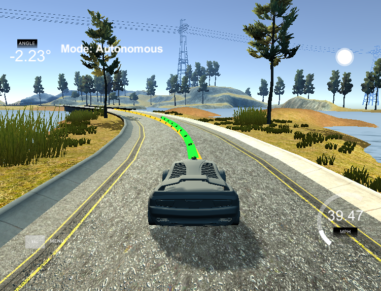

# CarND-Controls-MPC

--



A public version of this writeup is also [available here](https://medium.com/australian-robotics-society/self-driving-cars-calculating-actuation-f6b874c2ec70).

In this project, we’re presented with a simulated car in a simulated world, with waypoints (a series of <x, y> co-ordinates in the world) of a planned path ahead of it. The car’s task is to calculate what the steering wheel and acceleration and brake pedal commands should be to send to the car for it to follow the planned path smoothly and safely.

If you think about how humans drive, we don’t just look at the scene in front and base our steering and speed adjustment movements on that one single frame. We’re always planning ahead a few seconds with paths of where we can go, and taking into account how we’ll likely spin the wheel in a few seconds in order to make that right or left turn the best way possible.

That’s what Model Predictive Control does. It models out the car’s predicted movement based on a simple model, which basically says “if I’m pointing this way, with this speed, and this steering wheel angle, after a second, I believe I’ll be here in the world.”
We do this at every time step (i.e. every 100ms), and we plot out what our path will be over the next few seconds, given the current state of the car and the world.

We then actuate, that is, follow our calculated plan, adjusting our steering wheel and speed based on the very first time step’s commands (i.e. what we should be doing right now). But — we don’t just blindly follow our entire series of many computed actuations the entire way trough the few seconds that we calculated ahead of us in time; just as a human doesn’t plan out a path and then carry it out with closed eyes for few seconds. Things change. So while we need to compute the path a few seconds ahead in order to execute complex, optimal, and smooth moves, we only actually ever use the very first computed steering and speed commands.

So to get started, I first transform the waypoints given by the simulator into vehicle relative waypoints. 

I then pass these into the solver. The solver tries to minimise the cost function over N timesteps, each of 100ms.

The model predicts the car's movement using the equations:

```
      x_[t+1] = x[t] + v[t] * cos(psi[t]) * dt
      y_[t+1] = y[t] + v[t] * sin(psi[t]) * dt
      psi_[t+1] = psi[t] + v[t] / Lf * delta[t] * dt
      v_[t+1] = v[t] + a[t] * dt
      cte[t+1] = f(x[t]) - y[t] + v[t] * sin(epsi[t]) * dt
      epsi[t+1] = psi[t] - psides[t] + v[t] * delta[t] / Lf * dt
```
We translate that into something the solver can use by forcing the constraints to be zero, and rearranging the equations so that they are true when forced to zero:

```
      fg[1 + x_start    + t] = x1 - (x0 + v0 * CppAD::cos(psi0) * dt);
      fg[1 + y_start    + t] = y1 - (y0 + v0 * CppAD::sin(psi0) * dt);
      fg[1 + psi_start  + t] = psi1 - (psi0 - v0 * delta0 / Lf * dt);
      fg[1 + v_start    + t] = v1 - (v0 + a0 * dt);
      fg[1 + cte_start  + t] = cte1 - ((f0 - y0) + (v0 * CppAD::sin(epsi0) * dt));
      fg[1 + epsi_start + t] = epsi1 - ((psi0 - psides0) - v0 * delta0 / Lf * dt);
```

For N, the number of timesteps calculated, I at first tried 20, but my computer couldn't solve it fast enough and the simulated car often ran off the road. I also tried five, and it drove smoothly but with a large crosstrack error, with the car always on the rigth side of the road. So I settled with 10, which plots far enough out to drive smoothly and keeps the car in the centre of the road. I used dt = 0.1 (100ms), and didn't vary it from this - it seemed a suitable distance out based on 10 timesteps, about a car-lengths out ahead of the car.

For the cost function, I defined a number of coefficients to control what elements were taken into account and by how much in relation to each other. They are:

```
// How bad is it to be away from the centre of the
// road? Pretty bad.
#define COST_CROSSTRACK_ERROR 100 

// How bad is it to be angled differently than the
// ideal path? Not as bad.
#define COST_ANGLE_ERROR      10 

// How bad is it to be going slower than we want?
// Okay.
#define COST_SPEED_ERROR      5   

// How bad is it to speed up or turn left or right 
// quickly? Bad.
#define COST_MOVEMENT_ERROR   10  

// How bad is it to speed up, slow down, turn left 
// and right jittery? Real bad.
#define COST_JERK_ERROR       20  

// How bad is it to have velocity while taking a
// corner? Just don't do it!
#define COST_SPEED_CORNERING  50  
```

This resulted in a pretty smooth ride:


But the 100ms delay was giving it trouble, as seen by when the car swerves and oscilates back and forth around the centre of the track.

So to handle the 100ms delay, I 

